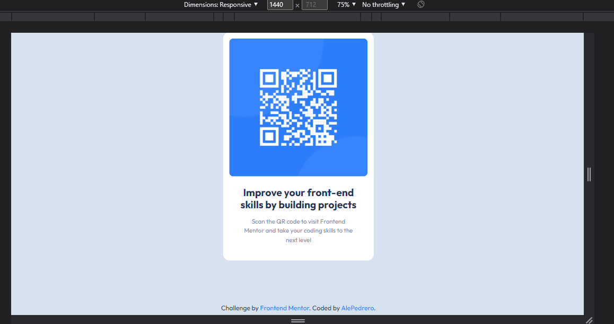
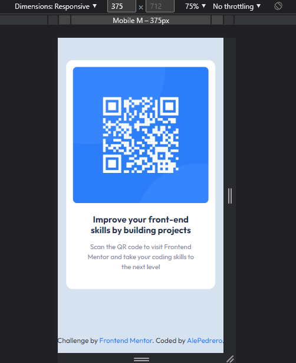

# Front End Mentor - QR code component challenge
This is my first Front End Mentor challenge, my solution to the [QR code component challenge on Frontend Mentor](https://www.frontendmentor.io/challenges/qr-code-component-iux_sIO_H).

## Overview
In this challenge I had to recreate a QR Card using mainly HTML and CSS.

### Screenshot

### Links

- Solution URL: [Add solution URL here](https://your-solution-url.com)
- Live Site URL: [Add live site URL here](https://your-live-site-url.com)

## My process
To be able to complete this simple challenge, I had to write the essential mark up on HTML, and proceed to do the neccessary styles by using Bootstrap and CSS. 

### Built with

- Semantic HTML5 markup
- CSS custom properties
- Bootstrap
- Flexbox
- CSS Grid

### What I learned

I am practically new to Bootstrap but I wanted to practice it more, because it is easier to do responsive websites with it, to be able to deliver a functional and good-looking view on Mobile and Desktop.

### Useful resources

- [Bootstrap](https://getbootstrap.com/docs/4.5/getting-started/introduction/) - This helped me a lot to deliver this simple project, I am using this version for now but then I will be using the newest version going forward.

## Author

- Website - [alejandra.dev](https://www.alejandra.dev)
- Frontend Mentor - [@AlePedrero](https://www.frontendmentor.io/profile/AlePedrero)
- Twitter - [@codedbyale](https://www.twitter.com/codedbyale)
